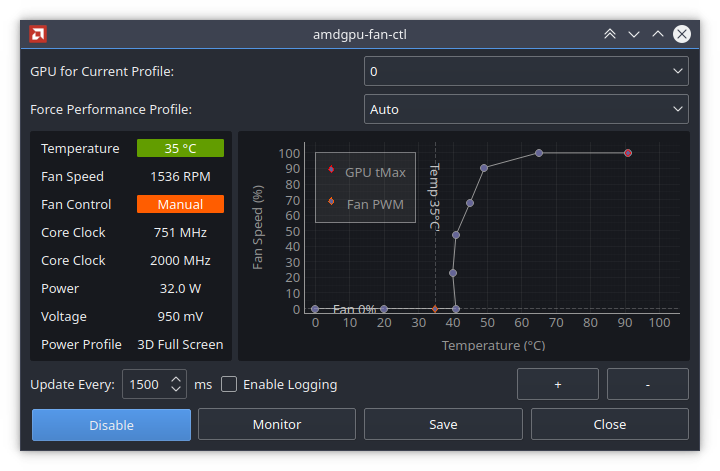

## qt-amdgpu-fan-ctl
Python script which enables a GUI controllable fan-curve for the AMDGPU driver under GNU/Linux

### Functionality:
- [x] Monitor GPU temperature, fan speed, performance levels, clock speeds etc!
- [x] Set and save GPU fan curve with near-unlimited control points
- [x] Monitor and set PowerPlay profile
- [ ] Handle multiple GPU fan profiles
- [ ] Overclocking Interface
- [ ] Configuration (log settings, SI units, enable/disable features like colorization, graph options)

### Screenshot:

### Requirements
- Qt5
- Python3
- pyqtgraph
- numpy

### System Control
To enable control (fan, performance levels, etc) the amdgpu sysfs interface requires ownership of the path,
it isn't necessary to have root permissions to have read access, it is only required for writing, therefore

You can either have run the script as root
> sudo python3 ./qt-amdgpu-fan-ctl.py

AND/OR

Allow SUDO with NOPASSWD:ALL for sudoers
> $USER ALL=(ALL) NOPASSWD:ALL

### License
GNU GPLv3

###.
###..
###...
### Jir8taiwan maintain of related information
** 2022.09.09 added and modified graphics style by Jir8taiwan from the original author version.
I change the color with confortible background to show off, and to be fixing Y axis of scale to be able to adjust during 100% fan speed.
The example figure:

